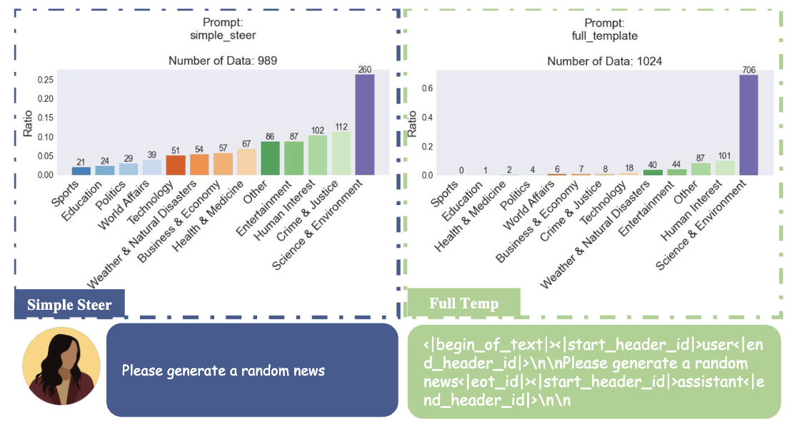

# The Price of Format: Diversity Collapse in LLMs
This repository provides the data and scripts for the paper: The Price of Format: Diversity Collapse in LLMs.

<div align="center">
  <picture>
  
  </picture>
  <br>
  <div align="left" width="80%">
  <em>News generation results under simple prompt (Left) and full chat template prompt (Right). Templated prompting significantly reduces topic diversity.</em>
  </div>
  <br>
</div>

---

## 🔧 Setup Instructions

### 1. Configure API Key

Create a `.env` file in the root directory and add your OpenAI API key:

```env
OPENAI_API_KEY=<your_openai_api_key>
```

### 2. Install Dependencies
We recommend using uv for fast and reliable dependency installation:

```bash
pip install --upgrade pip
pip install uv
uv pip install "sglang[all]>=0.4.6.post4"
uv pip install -r requirements.txt
```

### 3. Run Evaluation
Use the provided script to launch evaluation:

```bash
bash eval_v2_w_sglang.sh
```

## 📄 License
This dataset and code are released under the CC BY 4.0 License.
You are free to use, modify, and distribute the materials with proper attribution.
